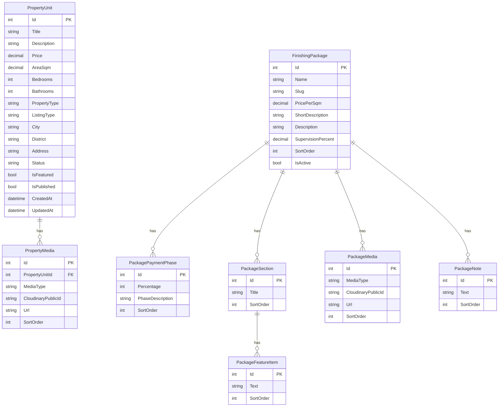

# خطة AqarCare — Backend أولاً

## الوضع الحالي

المشروع موجود كقالب Web API فارغ على [.NET 8](AqarCare/AqarCare.csproj) مع Swagger فقط — لا Controllers ولا EF Core ولا قاعدة بيانات بعد.

```1:36:AqarCare/Program.cs
namespace AqarCare
{
    public class Program
    {
        public static void Main(string[] args)
        {
            var builder = WebApplication.CreateBuilder(args);
            builder.Services.AddControllers();
            builder.Services.AddEndpointsApiExplorer();
            builder.Services.AddSwaggerGen();
            // ...
        }
    }
}
```

## قرارات التصميم (حسب اختيارك)

| القرار | الاختيار |
|--------|----------|
| حماية الأدمن | **API Key** في الهيدر `X-Api-Key` على مسارات `/api/admin/*` |
| باقات التشطيب | **Seed** من بيانات [HMA Group](https://hmagroup-eg.com/%D8%A8%D8%A7%D9%82%D8%A7%D8%AA-%D8%A7%D9%84%D8%AA%D8%B4%D8%B7%D9%8A%D8%A8/) ثم **CRUD من الأدمن** للتعديل |
| بيانات العملاء / نماذج التواصل | **مؤجّلة** — لا Lead/Inquiry في هذه المرحلة |
| الفرونت | **لاحقاً** — هذه الخطة للـ API + DB فقط |
| التوثيق للـ AI | ملف [`PROGRESS.txt`](PROGRESS.txt) في جذر الحل يُحدَّث بعد كل مرحلة |

## هيكل المشروع المقترح

```
AqarCare/
├── Controllers/
│   ├── PropertiesController.cs          # قراءة عامة
│   ├── FinishingPackagesController.cs   # قراءة عامة
│   └── Admin/
│       ├── AdminPropertiesController.cs
│       ├── AdminFinishingPackagesController.cs
│       └── AdminMediaController.cs
├── Data/
│   ├── AqarCareDbContext.cs
│   ├── Entities/
│   ├── Configurations/                  # Fluent API
│   ├── Migrations/
│   └── Seed/FinishingPackageSeeder.cs
├── DTOs/
├── Services/
│   ├── PropertyService.cs
│   ├── FinishingPackageService.cs
│   └── CloudinaryService.cs
├── Middleware/ApiKeyAuthMiddleware.cs
├── Filters/AdminApiKeyAttribute.cs
└── appsettings.json
PROGRESS.txt                               # جذر AqarCare.sln
```

## مخطط قاعدة البيانات



### حقول الوحدة العقارية (مبسّطة عن PropertyFinder)

- **عرض**: عنوان، وصف، سعر، مساحة، غرف نوم، حمامات، نوع (شقة/فيلا/...), نوع الإعلان (بيع/إيجار)
- **موقع**: مدينة، حي، عنوان
- **حالة**: متاح / محجوز / مباع + `IsPublished` + `IsFeatured`
- **وسائط**: صور + فيديو (Cloudinary URLs)

### باقات التشطيب (من HMA)

6 باقات بأسعار المتر: Classic 1800، Silver 2500، Gold 3500، Platinum 4500، VIP 7000، Ultra Super VIP 9000.

كل باقة تحتوي (كما في [صفحة Classic](https://hmagroup-eg.com/%D8%A7%D9%84%D8%A8%D8%A7%D9%82%D8%A9-%D8%A7%D9%84%D9%83%D9%84%D8%A7%D8%B3%D9%8A%D9%83/)):
- مراحل الدفع (35% / 30% / 25% / 10%)
- نسبة الإشراف (17.5%)
- أقسام (كهرباء، سباكة، أسقف، أبواب، سيراميك، نقاشة) + بنود تحت كل قسم
- ملاحظات (300/200/100 جنيه إضافية...)
- معرض صور (URLs لاحقاً عبر Cloudinary)

**Seed**: إدخال البيانات الكاملة لـ Classic كمرجع، وباقي الباقات بـ name/price/slug + هيكل فارغ أو جزئي — ثم تكمل/تعدّل من الأدمن.

## API Endpoints

### عامة (بدون Auth)

| Method | Route | الوظيفة |
|--------|-------|---------|
| GET | `/api/properties` | قائمة مع فلترة (نوع، مدينة، سعر، مساحة) + pagination |
| GET | `/api/properties/{id}` | تفاصيل وحدة + وسائط |
| GET | `/api/finishing-packages` | قائمة الباقات (cards) |
| GET | `/api/finishing-packages/{idOrSlug}` | تفاصيل باقة كاملة |

### أدمن (يتطلب `X-Api-Key`)

| Method | Route | الوظيفة |
|--------|-------|---------|
| POST/PUT/DELETE | `/api/admin/properties` | CRUD وحدات |
| POST/DELETE | `/api/admin/properties/{id}/media` | ربط/حذف وسائط |
| POST/PUT/DELETE | `/api/admin/finishing-packages` | CRUD باقات + أقسام + بنود |
| POST | `/api/admin/media/upload` | رفع صورة/فيديو إلى Cloudinary |
| DELETE | `/api/admin/media/{publicId}` | حذف من Cloudinary (اختياري) |

## Cloudinary

- NuGet: `CloudinaryDotNet`
- إعدادات في `appsettings.json`:

```json
"Cloudinary": {
  "CloudName": "",
  "ApiKey": "",
  "ApiSecret": "",
  "Folder": "aqarcare"
}
```

- رفع من الأدمن عبر `IFormFile` → Cloudinary Upload API → حفظ `PublicId` + `Url` في `PropertyMedia` / `PackageMedia`
- **ستطلب منك**: Cloud Name + API Key + API Secret عند التنفيذ

## SQL Server + EF Core

- NuGet: `Microsoft.EntityFrameworkCore.SqlServer`, `Microsoft.EntityFrameworkCore.Tools`, `Microsoft.EntityFrameworkCore.Design`
- Connection string في `appsettings.Development.json` (User Secrets أو env var — **لا commit للـ secrets**)
- **ستطلب منك**: connection string عند بدء المرحلة 1
- أوامر: `Add-Migration InitialCreate` ثم `Update-Database`

## حماية API Key

- Middleware أو `AdminApiKeyAttribute` يتحقق من `X-Api-Key` مقابل `Admin:ApiKey` في الإعدادات
- Swagger: تعريف Security Scheme للاختبار من Swagger UI

## CORS

- تفعيل CORS مفتوح في Development للفرونت لاحقاً؛ تقييد في Production عند الحاجة

## ملف PROGRESS.txt

يُنشأ في [`PROGRESS.txt`](PROGRESS.txt) ويُحدَّث بعد كل مرحلة:

```
# AqarCare Progress Log
Last updated: [date]
Current phase: [N]
Completed: ...
Pending: ...
Config needed: connection string, Cloudinary keys, Admin API key
Next steps for AI: ...
```

## مراحل التنفيذ

### المرحلة 1 — البنية التحتية
- NuGet packages + هيكل المجلدات
- `AqarCareDbContext` + Entities + Fluent configurations
- Migration + طلب connection string منك
- `PROGRESS.txt` — المرحلة 1

### المرحلة 2 — تسويق العقارات
- DTOs + `PropertyService`
- Public GET endpoints + Admin CRUD
- Pagination + filters
- `PROGRESS.txt` — المرحلة 2

### المرحلة 3 — باقات التشطيب
- DTOs + `FinishingPackageService`
- Public GET + Admin CRUD (nested sections/features/phases)
- Seed HMA data (6 packages، Classic كامل)
- `PROGRESS.txt` — المرحلة 3

### المرحلة 4 — Cloudinary + Auth
- `CloudinaryService` + upload endpoint
- API Key middleware + Swagger security
- طلب Cloudinary credentials منك
- `PROGRESS.txt` — المرحلة 4

### المرحلة 5 — اختبار وتوثيق
- اختبار Swagger لكل endpoints
- توثيق نماذج Request/Response في `PROGRESS.txt`
- قائمة ما ينتظر الفرونت

## ما تحتاجه منك قبل/أثناء التنفيذ

1. **Connection string** SQL Server — عند المرحلة 1
2. **Cloudinary** CloudName + ApiKey + ApiSecret — عند المرحلة 4
3. **Admin API Key** — يمكن توليده تلقائياً أو تزوّدني بقيمة
4. (لاحقاً) تصميم الفرونت — React/Blazor/Static HTML

## خارج النطاق (الآن)

- نماذج تواصل / Lead capture
- ASP.NET Identity / JWT (استبدل API Key لاحقاً إذا احتجت)
- Frontend
- بحث متقدم / خرائط / مقارنة وحدات
